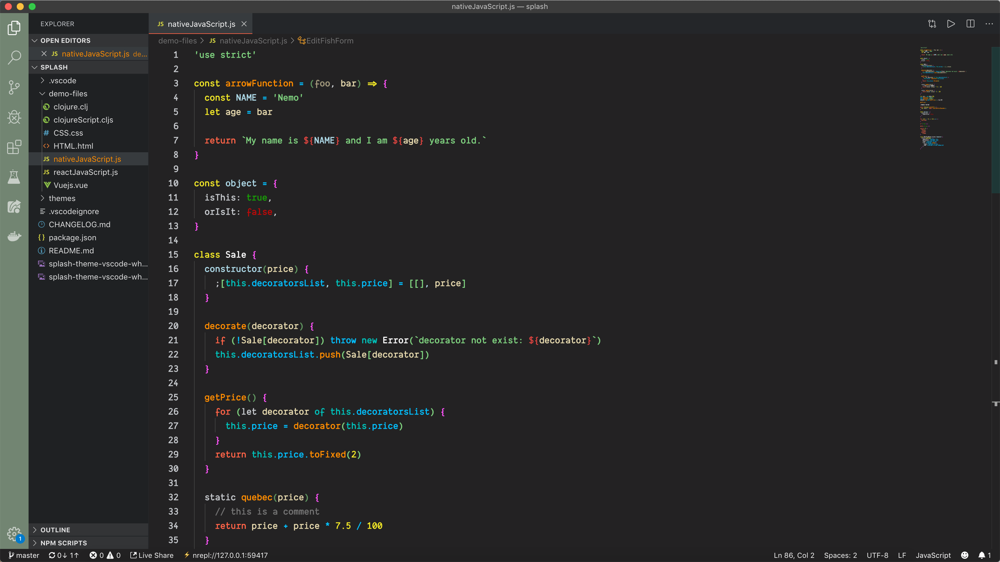
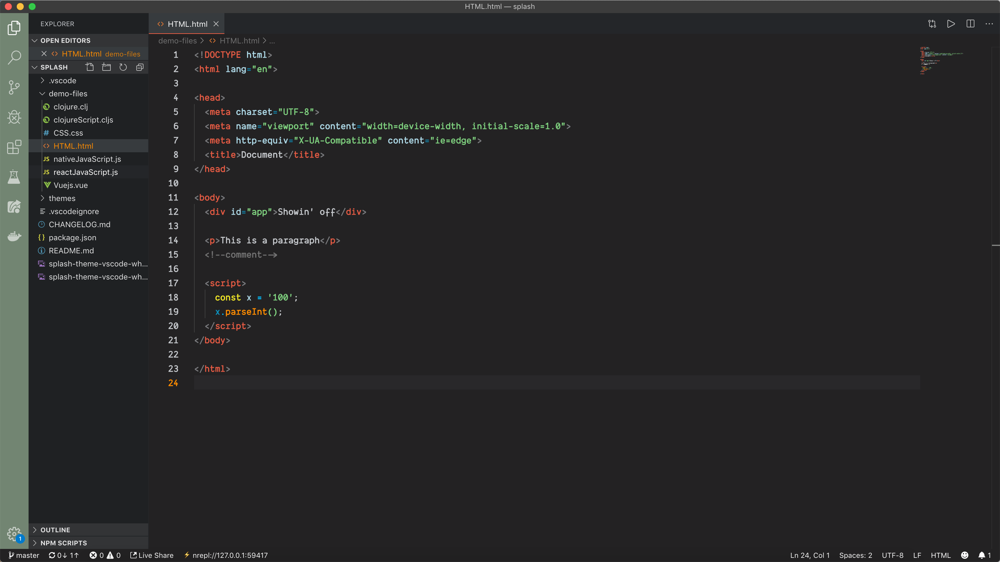
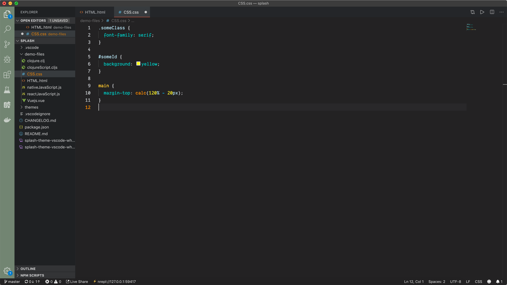

# Make up for beautiful web code 💄 (js, css, html)

> I found I could say things with color and shapes that I couldn’t say any other way – things I had no words for.\
> --  [Georgia O’Keeffe](https://en.wikipedia.org/wiki/Georgia_O%27Keeffe)

Splash will be a work in progress for a while so please be patient. This is one of my many passion projects so I only work on it when I feel like and have some time to spare. However, if you feel like I got something good going here and wanna help out, no one would be happier than me 😃 \
Just make a pull request or file an issue and I'll take a look at it.

# Have a look 👀
### Some Native JavaScript

### Some HTML

### Some CSS

### Oh, and how about a peek at some libs/framewoks. Here is React and Vue

   
  

# Installation

1.  Install [Visual Studio Code](https://code.visualstudio.com/)
2.  Launch Visual Studio Code
3.  Choose **Extensions** from menu
4.  Search for `Splash`
5.  Click **Install** to install it
6.  Click **Reload** to reload the Code
7.  From the menu bar click: Code > Preferences > Color Theme > **Splash**

**Enjoy!**
